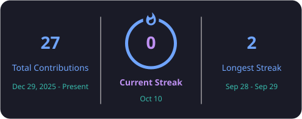

# Hi 👋, I'm Manthan Thakur

### 🎓 Computer Science Student

💻 Passionate about **Software Development, Cyber Security & Artificial Intelligence**

🌱 **Currently Learning**
- Data Structures & Algorithms
- Cyber Security
- Artificial Intelligence & Machine Learning
- App Development

🚀 **Working On**
- Open Source Contributions
- DSA Problem Solving

---

## 🌐 Connect With Me

---

## 💻 Tech Stack

  

---

## 📊 GitHub Analytics

  
  

  

---

## 🏆 GitHub Trophies

  

---

## 🐍 Contribution Snake

  <picture>
    <source media="(prefers-color-scheme: dark)" srcset="https://raw.githubusercontent.com/manthanstar1-coder/manthanstar1-coder/output/github-contribution-grid-snake-dark.svg">
    <source media="(prefers-color-scheme: light)" srcset="https://raw.githubusercontent.com/manthanstar1-coder/manthanstar1-coder/output/github-contribution-grid-snake.svg">
    
  </picture>

---

### ✨ Quote

> "Code. Learn. Build. Repeat."

⭐ If you like my work, consider following my profile.